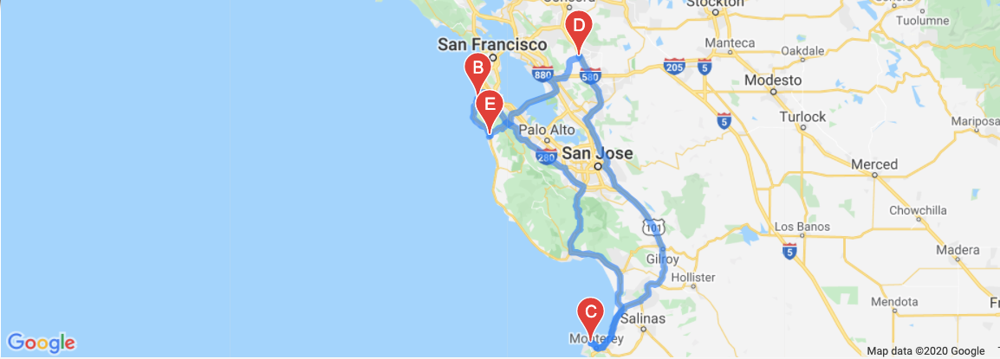

# World_Weather_Analysis

The purpose of the project is to work on the PlanMyTrip app that was developed initially. The work presented in this project are the few changes that the Team has recommended to take the app to the next level by adding the weather description to the weather data that was already previously retrieved. Then, test use input statements to filter the data for weather preferences, which will be used to identify potential travel destinations and nearby hotels. Then from the list of potential travel destinations, the beta tester will choose four cities to create a travel itinerary. Finally, using the Google Maps Directions API, a travel route was created between the four cities as well as a marker layer map.

### WeatherPy Travel Map

